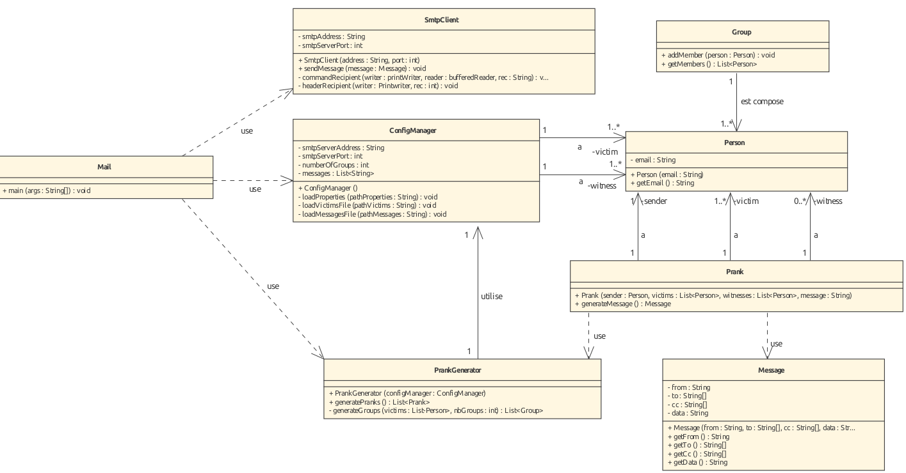

# RES labo SMTP

Gamboni Fiona, Tevaearai Rébecca

### Description du projet 

Cette application client permet d'envoyer des blagues par mails à des victimes réparties dans des groupes. Ces groupes sont composés d'un expéditeur et d'au moins deux destinataires. L'utilisateur est en mesure d'établir la liste des victimes et le nombre de groupe à piéger. L'utilisateur peut également définir les blagues envoyées. 

### Instructions pour mettre en place le serveur Mock SMTP sans Docker

- cloner le repository https://github.com/tweakers/MockMock

- modifier le `pom.xml`: 

  -  modifier la ligne:

  ```xml
   <groupId>org.dstovall</groupId> par <groupId>com.jolira</groupId>
  ```

  -  supprimer les lignes:

```xml
 <pluginRepositories>
        <pluginRepository>
            <id>onejar-maven-plugin.googlecode.com</id>
            <url>http://onejar-maven-plugin.googlecode.com/svn/mavenrepo</url>
        </pluginRepository>
</pluginRepositories>
```

- ouvrir un terminal:
  - dans le **dossier MockMock** : `mvn clean install`
  - dans le **dossier target**: `java -jar MockMock-1.4.0.one-jar.jar -p 2525`
- ouvrir un navigateur web:
  - entrer `localhost:8282`

### Instructions pour mettre en place le serveur Mock SMTP avec Docker

- cloner le repository

- dans le **dossier docker** :
  - lancer le script `build-image.sh` permettant de construire l'image mockmockserver.
  - lancer le script `run-container.sh` permettant de créer et lancer un container correspondant à l'image précédemment construite.

### Instructions pour la configuration

- cloner le repository si ce n'est pas déjà fait

- modifier à sa guise le **dossier config**:

  - **config.properties** où la configutation doit être définie comme tel:

  ```properties
  smtpServerAddress=localhost
  smtpServerPort=2525
  numberOfGroups=5
  witnessesToCC=fiona.gamboni@heig-vd.ch,rebecca.tevaearai@heig-vd.ch
  ```

  smtpServerAddress correspond à l'adresse IP du serveur SMTP. Il est conseillé d'y spécifier **localhost** pour utiliser le serveur MockMock mis en place. 

  smtpServerPort correspond au numéro de port du serveur SMTP. Il est également conseillé d'y spécifier **2525** car il a été configuré comme tel. 

  numberOfGroups correspond au nombre de groupe qui va être créer. Il est impératif d'y spécifier une **valeur numérique plus grande que 0**.

  witnessesToCC correspond aux personnes qui seront cc sur les mails. Ce champ optionnel permet aux utilisateurs de voir les blagues envoyées. **Des adresses emails séparées d'une virgule** doivent y être mentionnés.

  

  - **messages.utf8** où la liste de blagues doit être définie comme tel: 

  ```
  Subject: Confession
  
  Hi everyone, I have a big announcement to make:
  I hate you all
  
  ***
  Subject: ...
  ```

  La première ligne contient le Subject: titre du sujet

  Puis le message

  Puis le séparateur *** 

  

  - **victims.utf8** où la liste des victimes doit être définie comme tel:

  ```
  alec.berney@heig-vd.ch
  david.gonzalezleon@heig-vd.ch
  quentin.forestier@heig-vd.ch
  ...
  ```

  La liste des victimes correspond à **une liste d'adresses emails séparées par un retour à la ligne** . 

- lancer le programme

### Description de l'implémentation

Pour l'implémentation, nous nous sommes inspirées de la structure proposée dans les webcasts. 

Ainsi notre projet est découpé selon ces classes:





La classe `ConfigManager` permet de récupérer les informations (configuration, victimes, blagues) contenues dans le dossier config. 

La classe `Prank` définit qu'une blague est constituée d'un expéditeur, d'une liste de victimes et d'observateurs et d'une blague. 

La classe `PrankGenerator` permet de créer une ` Prank` pour chaque groupe qu'elle aura constitué.

La classe `SmtpClient` permet d'envoyer un message au serveur via une implémentation du protocole SMTP à l'aide d'une Socket API. 

Ainsi pour chaque `Prank ` générée un `Message` est envoyé par `SmtpClient`. 

L'implémentation a été réalisée avec le plug-in code with me d'Intellij ce qui nous a permis de travailler ensemble sur le projet.

